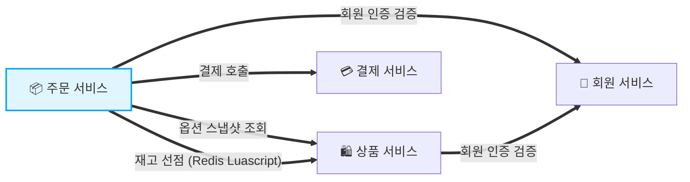
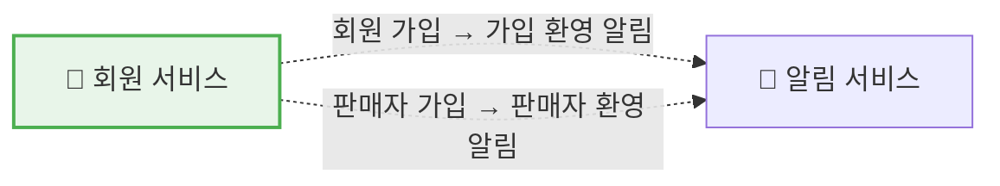
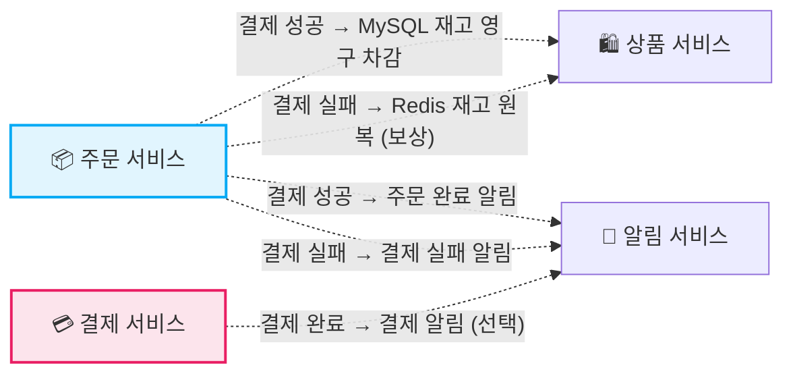

<div align="center">

# 🛒 mini-coupang

**MSA 기반 이커머스 백엔드 학습 프로젝트**


</div>

---

## 소개

mini-coupang 은 회원·상품·주문·결제·알림을 **독립적인 마이크로서비스**로 분리해 동기 호출(Feign)과 비동기 이벤트(Kafka)를 같이 다루는 이커머스 백엔드 프로젝트입니다.

**핵심 기술 포인트**

- **Hexagonal 아키텍처 (port/out + adapter)** — 외부 호출(Feign / Kafka)을 도메인이 직접 다루지 않고 포트로만 의존. 어댑터 교체로 통신 수단을 갈아끼울 수 있음
- **Redis Luascript 로 원자적 재고 선점/해제** — `GET → 검증 → DECRBY` 를 단일 명령으로 묶어 동시 요청 환경에서 네트워크 왕복 없이 재고 정합성 보장 (`-1=키 없음 / -2=재고 부족 / 0이상=차감 후 잔량`)
- **Spring Session Redis 외부 세션 저장소** — WAS 자체는 stateless, `HttpSession` 의 실 저장은 Redis (`spring:session:sessions:{id}`). 어떤 인스턴스로 라우팅되든 같은 세션 인식
- **Transactional Event Listener (AFTER_COMMIT)** — 이벤트 발행은 commit 직후에만, 트랜잭션이 롤백되면 메시지도 나가지 않음. 결제 성공 시 `order.confirmed` Kafka 토픽 발행 등에 적용
- **Saga 보상 이벤트** — 결제 실패 시 `order.payment-failed` 를 발행해 상품 서비스 컨슈머가 Redis 재고를 비동기로 원복. 별도 호출 흐름 없이 broker 가 보상 경로 책임
- **Kafka 컨슈머 멱등성 (`processed_events`)** — `(event_id, event_type)` UNIQUE 제약으로 중복 컨슘 차단. `@RetryableTopic` + `@DltHandler` 로 재시도/DLT 분리
- **`/internal/...` 내부 API 분리** — 공개 `/api/...` 와 다른 prefix 로 서비스 간 호출 전용 엔드포인트 구분. `CommonResponse<T>` 봉투로 응답 일관성

---

## 도메인 통신 구조

### 동기 통신 (Feign)



### 비동기 통신 (Kafka 이벤트)

**회원 이벤트**



**주문 이벤트**



> 굵직한 사용자 흐름 3종은 별도 다이어그램으로 정리되어 있습니다 → [Usecase.md](Usecase.md)

---

## 기술 스택

| Category | Stack |
|---|---|
| Language | Java 21 |
| Framework | Spring Boot 3.5.9 · Spring Cloud OpenFeign 2025.0.0 |
| Database | MySQL 8.4 (서비스별 스키마 분리) |
| Cache / 세션 / 재고 | Redis 7 · Lua Script · Spring Session Redis |
| Message Broker | Apache Kafka (KRaft 단일 노드, JSON String) |
| 인증 | HttpSession + Spring Session Redis 외부 저장 · BCrypt |
| ID 생성 | TSID Creator (이벤트 ID) |
| Build | Gradle Multi-project (Groovy DSL) |

---

## 유스케이스

### 회원 서비스 (member-server :8081)

| 유스케이스 | 👤 회원 | 🛒 판매자 |
|---|:---:|:---:|
| 회원 가입 / 판매자 가입 | ✅ | ✅ |
| 회원 로그인 / 판매자 로그인 | ✅ | ✅ |
| 로그아웃 | ✅ | ✅ |
| 내 정보 조회 (`/api/me`) | ✅ | ✅ |

### 상품 서비스 (product-server :8082)

| 유스케이스 | 👤 회원 | 🛒 판매자 | ⚙️ 시스템 |
|---|:---:|:---:|:---:|
| 카테고리 목록 조회 | ✅ | ✅ | |
| 상품 검색 (키워드 + 가격/카테고리 필터) | ✅ | | |
| 판매자 상품 목록 (페이지네이션) | | ✅ | |
| 판매자 상품 등록 (옵션·이미지·초기 재고) | | ✅ | |
| 옵션 스냅샷 조회 (`/internal/options/{id}`) | | | ✅ |
| 재고 선점 (`/internal/stocks/{id}/reserve`) | | | ✅ |
| Kafka 컨슈머: 주문 확정 시 MySQL 재고 차감 | | | ✅ |
| Kafka 컨슈머: 결제 실패 시 Redis 재고 원복 | | | ✅ |

### 주문 서비스 (order-server :8084)

| 유스케이스 | 👤 회원 |
|---|:---:|
| 단건 주문 (인증 → 옵션 조회 → 재고 선점 → 결제 → 영속화) | ✅ |

### 결제 서비스 (payment-server :8083)

| 유스케이스 | ⚙️ 시스템 |
|---|:---:|
| 결제 호출 (`/internal/payments/charge`, simulated latency) | ✅ |
| Kafka 발행: `payment.completed` (AFTER_COMMIT) | ✅ |

### 알림 서비스 (notification-server :8085)

| 유스케이스 | ⚙️ 시스템 |
|---|:---:|
| 가입 환영 알림 (`member.signed-up`, `seller.signed-up` 컨슈머) | ✅ |
| 주문 완료 / 결제 실패 알림 (`order.confirmed`, `order.payment-failed`) | ✅ |
| 결제 알림 (`payment.completed`) | ✅ |

자세한 흐름 다이어그램은 [Usecase.md](Usecase.md) — 핵심 3종 (회원가입 / 상품 주문 / 상품 검색) 만 시각화.

---

## Kafka 토픽

| 토픽 | Producer | Consumer |
|---|---|---|
| `member.signed-up` | 회원 서비스 | 알림 서비스 |
| `seller.signed-up` | 회원 서비스 | 알림 서비스 |
| `order.confirmed` | 주문 서비스 | 상품 서비스, 알림 서비스 |
| `order.payment-failed` | 주문 서비스 | 상품 서비스 (보상), 알림 서비스 |
| `payment.completed` | 결제 서비스 | 알림 서비스 |

메시지 봉투 / 페이로드 / 멱등성 키 규칙은 [Kafka-Topics.md](Kafka-Topics.md).

## Redis 키

| 키 패턴 | 용도 | 타입 |
|---|---|---|
| `stock:option:{optionId}` | 옵션 재고 (선점/원복 hot path) | String (Lua 명령) |
| `spring:session:sessions:{sessionId}` | Spring Session 외부 저장 | Hash |

자세한 TTL / 명령 / 만료 정책은 [Redis-Keys.md](Redis-Keys.md).

---

## 모듈 구조

```
mini-coupang/
├── common-modules/        # 공유 라이브러리 (BusinessException, ErrorCode, EventTopic, KafkaProducer, BaseEntity, JsonConverter)
├── member-server/         # 회원 · 인증 서비스 (8081)
├── product-server/        # 상품 · 카테고리 · 재고 서비스 (8082)
├── payment-server/        # 결제 서비스 (8083)
├── order-server/          # 주문 오케스트레이션 서비스 (8084)
├── notification-server/   # 알림 서비스 (8085, consumer-only)
├── shared/
│   ├── docker/            # docker-compose (Kafka KRaft, MySQL × 5, Redis)
│   └── k6/                # 부하 시나리오 (등록 / 검색 / 주문)
├── diagrams/              # 굵직한 3 usecase 의 mermaid 소스 + 렌더 PNG
├── Usecase.md             # API 명세 + 핵심 흐름 다이어그램
├── Kafka-Topics.md        # 토픽 매트릭스
├── Redis-Keys.md          # 키 패턴
├── build.gradle
└── settings.gradle
```

---

## 실행

```bash
# 1) 인프라 (Kafka KRaft + MySQL × 5 schemas + Redis)
cd mini-coupang/shared/docker
docker compose up -d

# 2) 서비스 5종 (각각 별도 셸에서)
./gradlew :member-server:bootRun        # :8081
./gradlew :product-server:bootRun       # :8082
./gradlew :payment-server:bootRun       # :8083
./gradlew :order-server:bootRun         # :8084
./gradlew :notification-server:bootRun  # :8085
```

헬스체크: `curl http://localhost:8081/actuator/health` (각 포트 동일 패턴).

```bash
# 전 모듈 컴파일
./gradlew compileJava

# 모듈별 테스트
./gradlew :order-server:test
```
