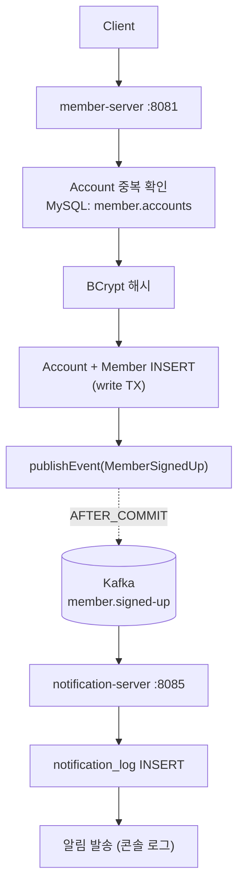

# UC-01 회원가입

| 항목 | 내용 |
|---|---|
| 엔드포인트 | `POST /auth/signup/member` |
| 인증 | 없음 |
| 입력 | `{ email, password, name }` |
| 출력 | `{ accountId, memberId }` |

## 흐름

다이어그램 소스 (Mermaid)

## 사용 컴포넌트

| 종류 | 사용 |
|---|---|
| 서비스 | member-server, notification-server |
| 인프라 | MySQL (member 스키마), Kafka (`member.signed-up`) |
| 외부 시스템 | 없음 |

## 참고

- 트랜잭션은 member-server 단일 commit 으로 끝난다.
- 알림 실패는 가입 실패로 이어지지 않는다 (publish 는 commit 후 비동기).
- 이메일 중복은 DB UNIQUE 제약 + `findByEmail` 선조회 둘 다.
