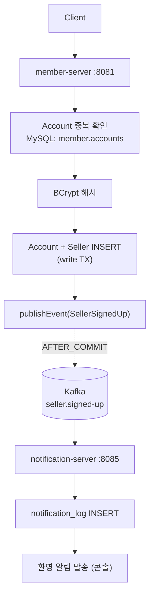

# UC-02 판매자 가입

| 항목 | 내용 |
|---|---|
| 엔드포인트 | `POST /auth/signup/seller` |
| 인증 | 없음 |
| 입력 | `{ email, password, brandName, ... }` |
| 출력 | `{ accountId, sellerId }` |

## 흐름

다이어그램 소스 (Mermaid)

## 사용 컴포넌트

| 종류 | 사용 |
|---|---|
| 서비스 | member-server, notification-server |
| 인프라 | MySQL (member 스키마), Kafka (`seller.signed-up`) |

## 참고

- UC-01 과 구조가 동일. 차이는 도메인 객체 (Member vs Seller) 와 토픽.
- Account 테이블은 member 와 seller 가 공유 (한 사람이 회원 + 판매자 동시 가능).
