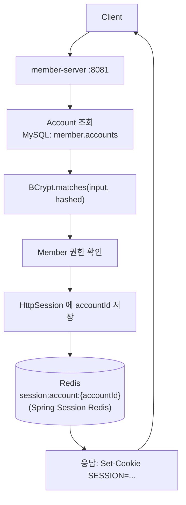

# UC-03 회원 로그인

| 항목 | 내용 |
|---|---|
| 엔드포인트 | `POST /auth/login` |
| 인증 | 없음 |
| 입력 | `{ email, password }` |
| 출력 | `{ accountId, memberId }` + 세션 쿠키 (`SESSION`) |

## 흐름

다이어그램 소스 (Mermaid)

## 사용 컴포넌트

| 종류 | 사용 |
|---|---|
| 서비스 | member-server |
| 인프라 | MySQL (member 스키마), Redis (세션 백킹) |
| 외부 시스템 | 없음 |

## 참고

- 모놀리스 현재는 in-memory `HttpSession` 사용 (Redis 백킹 미구성). MSA 전환 시 `spring-session-data-redis` 도입해서 다중 인스턴스 간 세션 공유.
- 다른 서비스는 세션 자체를 보지 않고 member-server Feign `GET /internal/auth/verify` 로 검증 (Gateway 미도입 단계).
- 로그인 실패 응답은 401 + `INVALID_CREDENTIALS`.
