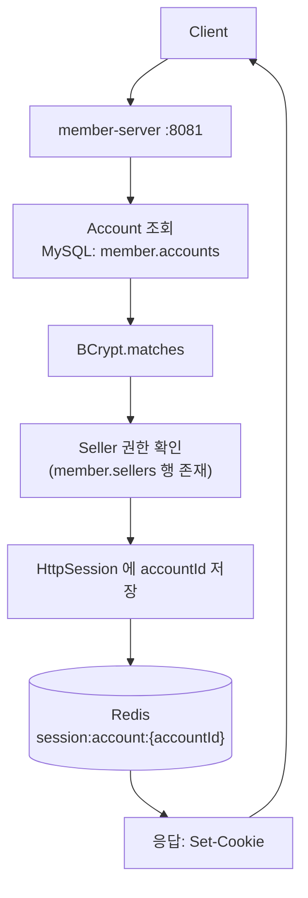

# UC-04 판매자 로그인

| 항목 | 내용 |
|---|---|
| 엔드포인트 | `POST /auth/login/seller` |
| 인증 | 없음 |
| 입력 | `{ email, password }` |
| 출력 | `{ accountId, sellerId }` + 세션 쿠키 |

## 흐름

다이어그램 소스 (Mermaid)

## 사용 컴포넌트

| 종류 | 사용 |
|---|---|
| 서비스 | member-server |
| 인프라 | MySQL (member 스키마), Redis (세션 백킹) |

## 참고

- UC-03 과 구조 동일, Seller 권한 검증 단계만 다름.
- 한 Account 가 회원 + 판매자 둘 다 가질 수 있으므로 로그인 엔드포인트가 두 개로 분리되어 권한이 명시적으로 결정된다.
