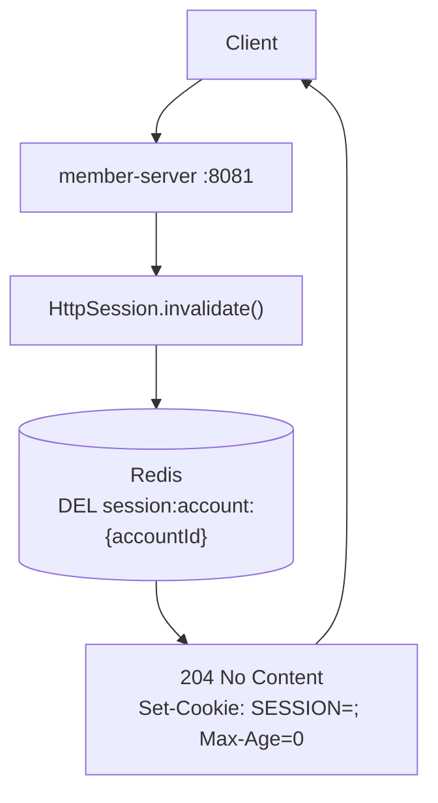

# UC-05 로그아웃

| 항목 | 내용 |
|---|---|
| 엔드포인트 | `POST /auth/logout` |
| 인증 | 세션 |
| 입력 | 없음 |
| 출력 | 204 No Content |

## 흐름

## 사용 컴포넌트

| 종류 | 사용 |
|---|---|
| 서비스 | member-server |
| 인프라 | Redis (세션 삭제) |

## 참고

- DB 호출 없음. Redis 만 건드린다.
- 세션이 없는 요청도 204 로 응답 (idempotent).
