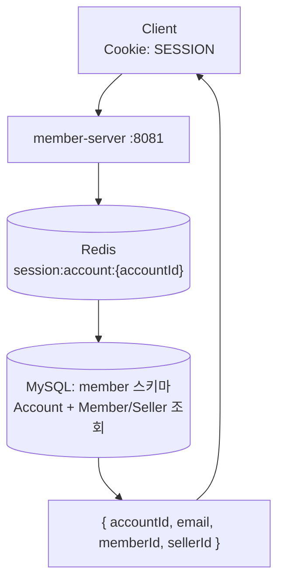

# UC-06 내 정보 조회

| 항목 | 내용 |
|---|---|
| 엔드포인트 | `GET /api/me` |
| 인증 | 세션 |
| 입력 | 없음 (`@LoginRequired Long accountId` 자동 주입) |
| 출력 | `{ accountId, email, memberId?, sellerId? }` |

## 흐름

## 사용 컴포넌트

| 종류 | 사용 |
|---|---|
| 서비스 | member-server |
| 인프라 | Redis (세션), MySQL (member 스키마) |

## 참고

- 세션 없으면 401 `UNAUTHENTICATED`.
- 다른 서비스에서 사용자 정보가 필요하면 member-server 의 `GET /internal/auth/verify` Feign 호출 (별도 엔드포인트).
