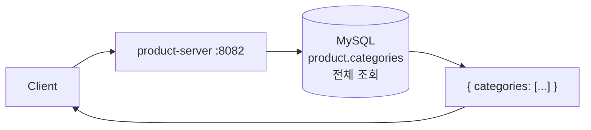

# UC-07 카테고리 목록

| 항목 | 내용 |
|---|---|
| 엔드포인트 | `GET /api/categories` |
| 인증 | 없음 |
| 입력 | 없음 |
| 출력 | `{ categories: [{ id, name, slug }, ...] }` |

## 흐름

## 사용 컴포넌트

| 종류 | 사용 |
|---|---|
| 서비스 | product-server |
| 인프라 | MySQL (product 스키마) |

## 참고

- read-only TX, 캐시 미적용. 카테고리는 행 수가 적어 (~10) 매번 조회.
- 추후 변동이 거의 없으면 in-process 캐시 도입 후보 (Caffeine, TTL 5분).
