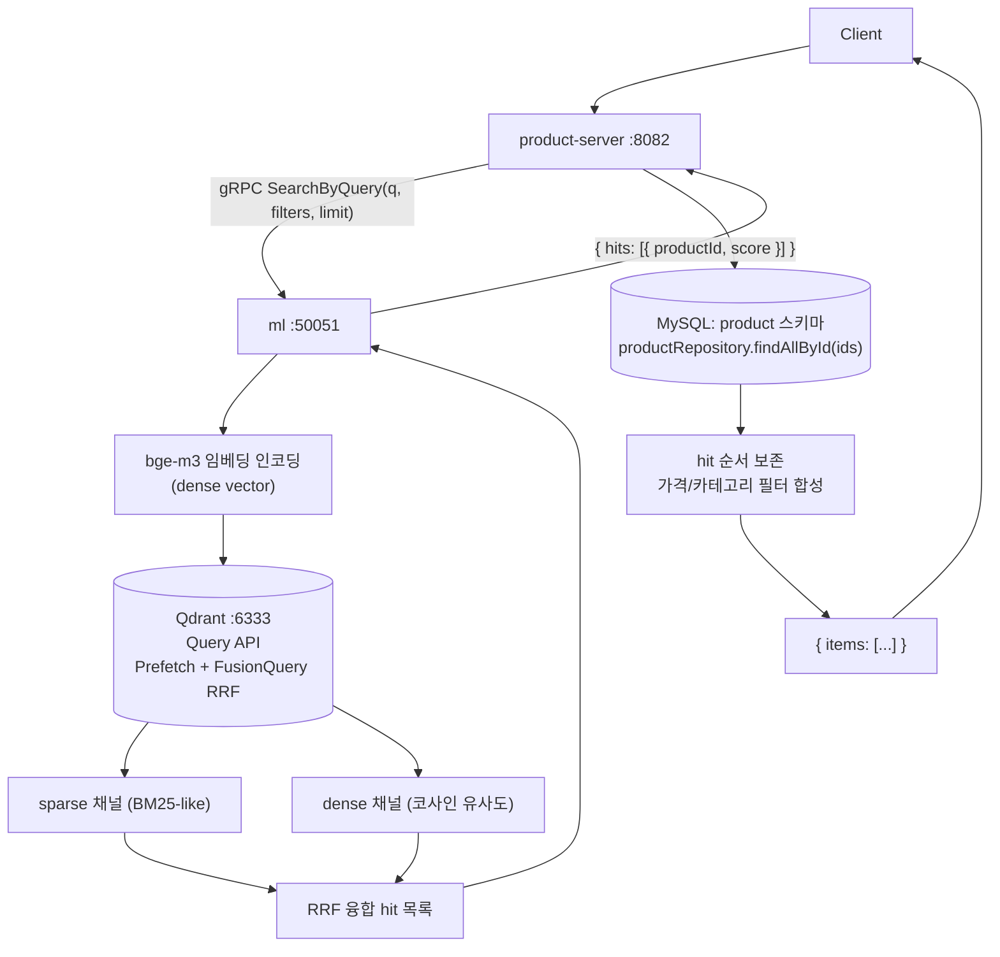

# UC-08 상품 검색 (하이브리드)

| 항목 | 내용 |
|---|---|
| 엔드포인트 | `GET /api/products/search?q=&category_id=&min_price=&max_price=&limit=` |
| 인증 | 없음 |
| 입력 | 쿼리 파라미터 (q 필수, 나머지 선택) |
| 출력 | `{ items: [{ id, name, basePrice, sellerId, score, ... }, ...] }` |

## 흐름

## 사용 컴포넌트

| 종류 | 사용 |
|---|---|
| 서비스 | product-server, ml (Python gRPC) |
| 인프라 | MySQL (product 스키마), Qdrant |
| 외부 시스템 | 없음 (bge-m3 모델은 ml 컨테이너 내장) |

## 참고

- lexical (sparse) + semantic (dense) 두 채널을 Qdrant 의 Query API 한 번 호출로 RRF 융합 (Prefetch + FusionQuery).
- `MeasureStepAspect` 가 `SearchSteps.embedAndSearch` / `fetch` 단계별 latency 를 기록 (Prometheus).
- 상태 필터: `ProductStatus.ACTIVE` 만 노출 (suspended/sold-out 제외). Qdrant payload index 가 양 채널 모두에 적용.
- `limit` 은 1~100 으로 clamp.
