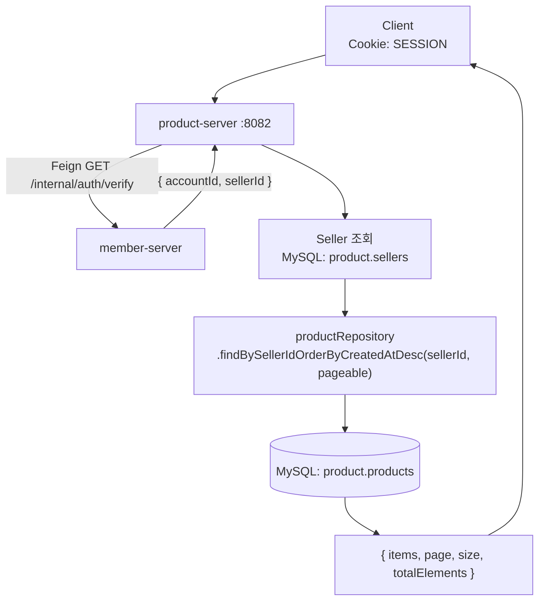

# UC-09 판매자 상품 목록

| 항목 | 내용 |
|---|---|
| 엔드포인트 | `GET /api/seller/products?page=&size=` |
| 인증 | 세션 (판매자) |
| 입력 | 페이징 파라미터 |
| 출력 | `{ items: [{ id, name, basePrice, status, optionsCount, imagesCount, createdAt }, ...], page, size, totalElements }` |

## 흐름

다이어그램 소스 (Mermaid)

## 사용 컴포넌트

| 종류 | 사용 |
|---|---|
| 서비스 | product-server, member-server (인증 검증 Feign) |
| 인프라 | MySQL (product 스키마, member 스키마) |

## 참고

- 인증 검증은 매 요청 member-server Feign 호출로 한다.
- read-only TX. 판매자 본인 데이터만 조회 (sellerId 일치 여부 체크).
- 페이징 기본 `page=0, size=20`, `createdAt DESC`.
