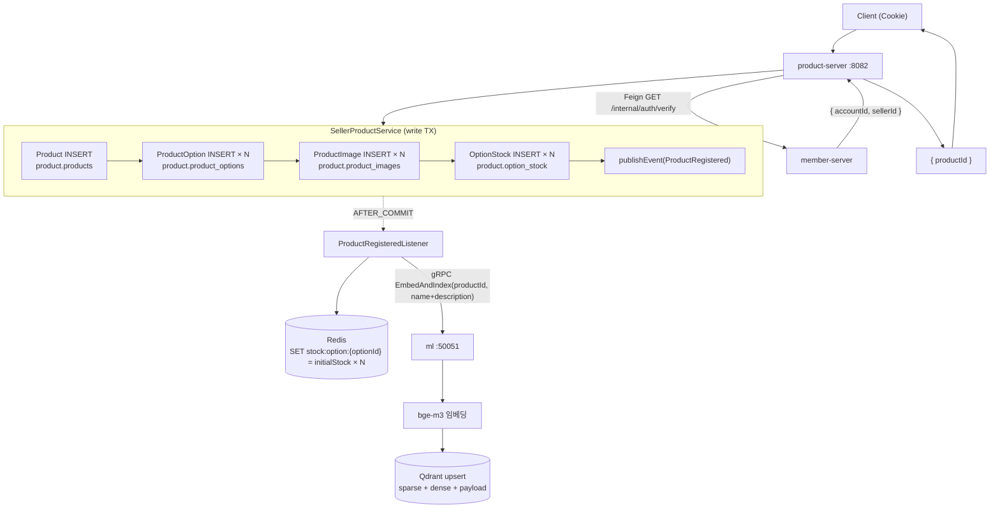

# UC-10 상품 등록

| 항목 | 내용 |
|---|---|
| 엔드포인트 | `POST /api/seller/products` |
| 인증 | 세션 (판매자) |
| 입력 | `{ categoryId, name, description, basePrice, options: [{ optionName, sku, additionalPrice, initialStock }, ...], images: [{ url, primary }, ...] }` |
| 출력 | `{ productId, ... }` |

## 흐름

다이어그램 소스 (Mermaid)

## 사용 컴포넌트

| 종류 | 사용 |
|---|---|
| 서비스 | product-server, member-server (인증 Feign), ml (gRPC) |
| 인프라 | MySQL (product 스키마), Redis (재고 키), Qdrant (검색 인덱스) |

## 참고

- 트랜잭션 자체는 MySQL 단일 commit. Redis SET 과 Qdrant upsert 는 commit 후 비동기.
- Redis SET 또는 Qdrant 색인 실패 시 상품은 생성되지만 검색 또는 주문이 불가능한 상태가 될 수 있다 (eventual consistency 수용). 장애 복구 절차: MySQL 기준으로 재색인.
- Kafka 로 publish 하지 않는다. product-server 내부에서 끝나는 fan-out (Redis + Qdrant). 다른 서비스 관여 없음.
