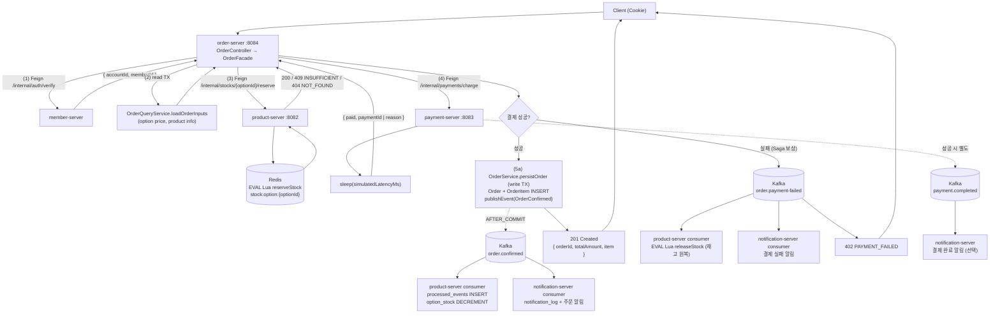

# UC-11 주문 생성

| 항목 | 내용 |
|---|---|
| 엔드포인트 | `POST /api/orders` |
| 인증 | 세션 (회원) |
| 입력 | `{ optionId, quantity, simulateFailure? }` |
| 출력 | `{ orderId, totalAmount, item: { ... } }` |

## 흐름

이 usecase 가 시스템에서 가장 많은 컴포넌트를 거친다. 동기 (Feign) 와 비동기 (Kafka) 가 모두 등장하고 결제 실패 시 Saga 보상이 작동한다.

## 사용 컴포넌트

| 종류 | 사용 |
|---|---|
| 서비스 | order-server (오케스트레이션), member-server (인증), product-server (재고), payment-server (결제), notification-server (알림) |
| 인프라 | MySQL (order, product 스키마), Redis (`stock:option:*`), Kafka (`order.confirmed`, `order.payment-failed`, `payment.completed`) |

## 트랜잭션 / 정합성

- read TX (조회), 결제 (외부 호출, 트랜잭션 외부), write TX (Order INSERT) 의 세 단계 분리.
- Redis 재고는 hot path 의 원장 (선점 단계), MySQL `option_stock` 은 AFTER_COMMIT Kafka 이벤트로 수렴되는 보조 원장.
- 결제 실패 시 Redis 재고 복구는 Kafka 비동기 (수 ms ~ 수 초 lag 가능). 그동안 다른 사용자에게 일시적 INSUFFICIENT 가능 (UX 상 재시도로 해소).

## 검증 (동시성)

- 200-thread 동시 주문 + 5% simulateFailure 주입 시 정합 상태 수렴 확인 (`PlaceOrderLuaSagaConcurrencyTest`).
- 200-thread 가 같은 SKU 재고 100 개를 두고 경쟁 → 성공 + 실패 합이 200, 성공 ≤ 100, 최종 재고 = 100 - 성공.
