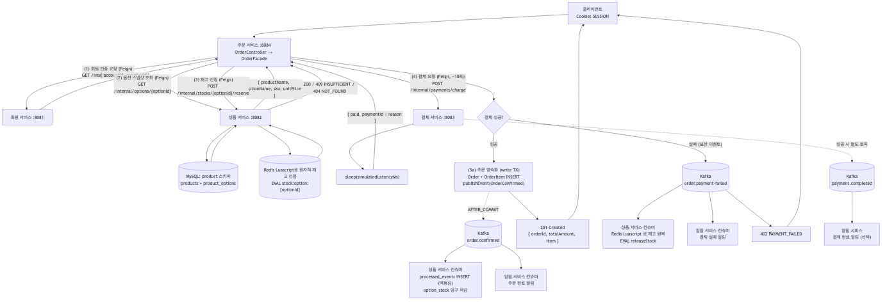
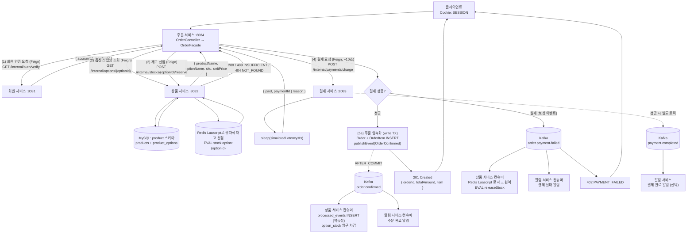

# UC-02 상품 주문

| 항목 | 내용 |
|---|---|
| 엔드포인트 | `POST /api/orders` |
| 인증 | 세션 (회원) |
| 입력 | `{ optionId, quantity, simulateFailure? }` |
| 출력 | `{ orderId, memberId, status, totalAmount, paymentId, item: { ... } }` |

## 흐름

이 usecase 가 시스템에서 가장 많은 컴포넌트를 거친다. 동기 (Feign) 와 비동기 (Kafka) 가 모두 등장하고, 결제 실패 시에는 보상 이벤트로 재고를 되돌린다.

다이어그램 소스 (Mermaid)

## 사용 컴포넌트

| 종류 | 사용 |
|---|---|
| 서비스 | 주문 서비스 (오케스트레이션), 회원 서비스 (인증), 상품 서비스 (옵션 조회 + 재고), 결제 서비스, 알림 서비스 |
| 인프라 | MySQL (orders, product 스키마), Redis (`stock:option:*`), Kafka (`order.confirmed`, `order.payment-failed`, `payment.completed`) |

## 트랜잭션 / 정합성

- 옵션 조회 → 재고 선점 → 결제 (외부 호출, 트랜잭션 외부) → 주문 영속화 (write TX) 단계로 분리된다.
- Redis 재고는 hot path 의 1차 원장 (선점 단계). MySQL `option_stock` 은 AFTER_COMMIT Kafka 이벤트로 수렴되는 보조 원장이다.
- 결제 실패 시 Redis 재고 복구는 Kafka 비동기 (수 ms ~ 수 초 lag 가능). 그동안 다른 사용자에게 일시적 INSUFFICIENT 가 보일 수 있고, UX 상 재시도로 해소된다.

## 검증 (동시성)

- 200-thread 동시 주문 + 5% `simulateFailure` 주입 시 정합 상태 수렴 확인 (`PlaceOrderLuaSagaConcurrencyTest`).
- 200-thread 가 같은 SKU 재고 100 개를 두고 경쟁 → 성공 + 실패 합이 200, 성공 ≤ 100, 최종 재고 = 100 - 성공.
