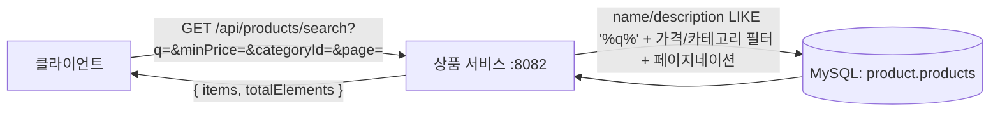

# UC-03 상품 검색

| 항목 | 내용 |
|---|---|
| 엔드포인트 | `GET /api/products/search` |
| 인증 | 없음 |
| 입력 | `?q={keyword}&minPrice={n}&maxPrice={n}&categoryId={n}&page={n}&size={n}` |
| 출력 | `{ items: [...], page, size, totalElements }` |

## 흐름

키워드는 MySQL `LIKE '%q%'` 로 product 이름/설명을 1차 매칭하고, 가격·카테고리 필터를 합성해 페이지네이션한다. 추후 lexical/dense 두 채널 + RRF 융합으로 확장하기 위한 자리는 남겨두되, 현재 상태에서는 단일 채널만 활성화돼 있다.

다이어그램 소스 (Mermaid)

## 사용 컴포넌트

| 종류 | 사용 |
|---|---|
| 서비스 | 상품 서비스 |
| 인프라 | MySQL (product 스키마) |
| 외부 시스템 | 없음 |

## 참고

- 키워드 컬럼은 인덱싱 안 된 LIKE 검색이라 데이터 양이 커지면 풀스캔 비용이 커진다.
- 확장 여지: lexical (BM25) + dense (vector) 하이브리드 검색을 별도 인덱스 (예: Qdrant) 로 옮기는 것이 다음 자연스러운 단계.
