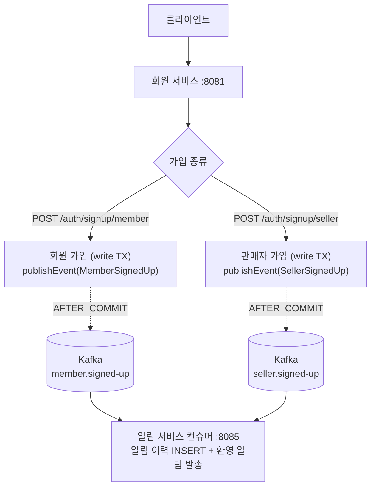

# UC-01 회원가입 (회원 + 판매자)

| 항목 | 내용 |
|---|---|
| 엔드포인트 | `POST /auth/signup/member`, `POST /auth/signup/seller` |
| 인증 | 없음 |
| 입력 (회원) | `{ email, password, name, phoneNumber?, nickname? }` |
| 입력 (판매자) | `{ email, password, businessName, businessRegistrationNumber, representativeName, phoneNumber }` |
| 출력 | `{ accountId, memberId }` 또는 `{ accountId, sellerId }` |

## 흐름

가입 자체는 단일 write TX 안에서 끝난다. 핵심은 commit 직후의 이벤트 발행과 알림 서비스 컨슈머가 같은 토픽으로 받아 처리한다는 점.

다이어그램 소스 (Mermaid)

## 사용 컴포넌트

| 종류 | 사용 |
|---|---|
| 서비스 | 회원 서비스, 알림 서비스 |
| 인프라 | MySQL (member 스키마), Kafka (`member.signed-up`, `seller.signed-up`) |
| 외부 시스템 | 없음 |

## 트랜잭션 / 정합성

- 가입 자체는 회원 서비스 단일 commit 으로 끝난다.
- 알림 발행은 `@TransactionalEventListener(AFTER_COMMIT)` 로 트랜잭션 commit 후 비동기 발행된다. 알림 발송 실패가 가입 실패로 이어지지 않는다 (Outbox 미도입 단계의 trade-off).
- 이메일 중복은 DB UNIQUE 제약 + `findByEmail` 선조회 둘 다 확인한다.
